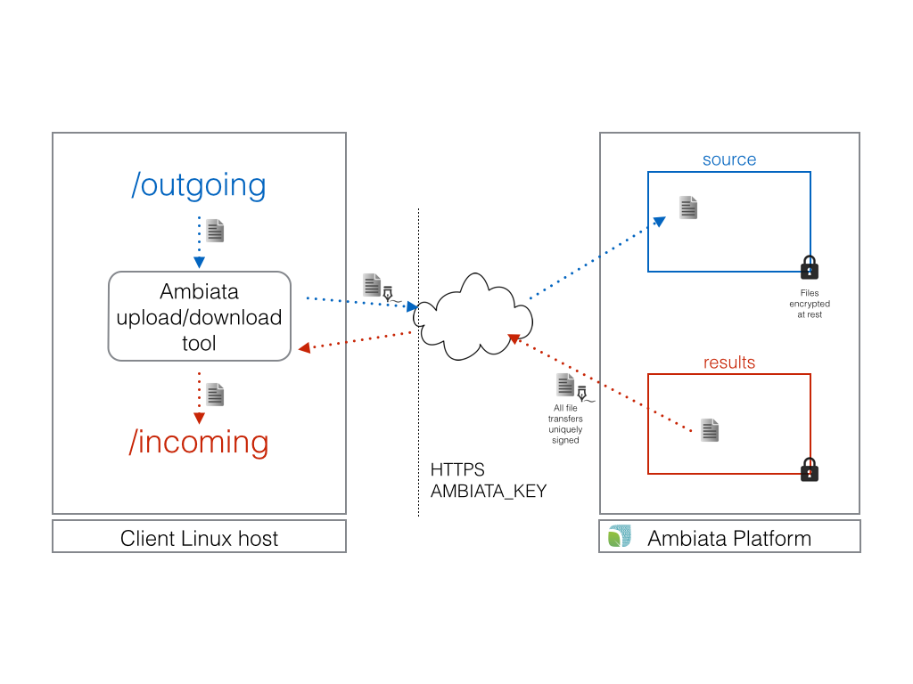

tatooine-cli
============

High level data flows
---------------------
High level view of how data moves in/out between a client and Ambiata.

## Upload flow from a customers filesystem

(as discussed with @nhibberd and @michaelneale with lots of arm waving and not drawing on the walls we weren't mean't to draw on)

Preconditions:

* Daemon runs on customers (linux, hopefully) box
* Daemon has rw access to (say) /dropbox
* Daemon configured with AMBIATA_API_KEY (at least)

### Directory layout
* `/dropbox` - where customers can dump files to be ingested. Mv or write in place should be fine.

* `/dropbox/.processing` - when files dropped "above" are deemed complete, they are moved here to be uploaded. This is a WIP directory, best to not manually touch files in here.

* `/dropbox/archive` - stuff that has been uploaded gets moved here. Customers are free to delete stuff in here to save space.

* `/dropbox/.hashfiles` - This is used to track incoming files to see when they have been "stable enough" to move into `.processing.` A WIP directory and it is best not to touch files in here.

It is recommended that /dropbox be an "ordinary" local filesystem, as files will be moved and deleted in there. To conserve space customers are free to delete from archive, but it is best to not touch other files if possible.

### Process

The /dropbox directory is scanned, where files are compared with a previous hash of their contents. If the contents (by comparing hash) has been stable for a few minutes, the file gets moved to /dropbox/.processing.

The `.processing` directory is scanned, and for each file a multipart upload started, and on completion the file is moved to archive (there is a chance to fork/join multiple multipart uploads here if needed).

The daemon will obtain a fresh token from tatooine server every 24 hours for a given "feed" (this can be cached). This includes the path of where the file is transferred to.
